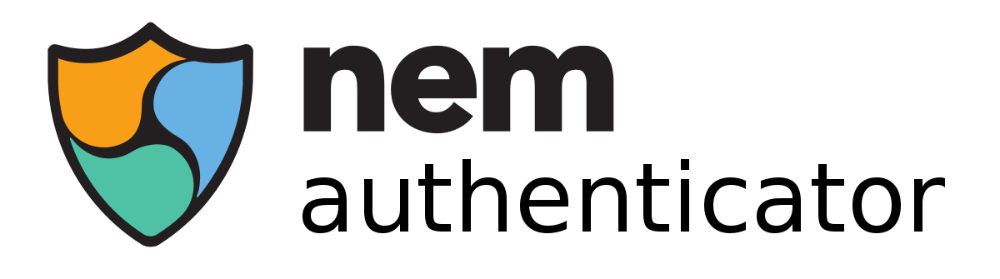

# NEM Authenticator

NEM Authenticator is a 100% decentralized 2 Factor Confirmation system to secure your account assets from being stolen using the NEM Blockchain native features.
The system consists in two applications:

- Web Page: Generates and manages the NEM Authenticator accounts to secure the assets via a clean and easy to use interface.
- Mobile Application: Lists all pending transactions to be confirmed by the account owner, displaying all the critical information of each transaction before the transaction is signed.

NEM Authenticator system is aimed to prevent the user to loose its assets when a device is compromised and it gives a easy way to remove the compromised account when the private key is stolen by a evil user. So, the evil user cannot move your assets without the confirmation of the second device, making it a robust system to manage your assets and a easy method to operate with them without compromise the security.

The system works for NEM MainNet and TestNet.

Keywords: NEM, 2 Factor Confirmation, 2 Factor Authentication, Multisig Account, Security, Mobile Application

## How to contribute

Check [CONTRIBUTING.md](CONTRIBUTING.md)

## Collaborators

| username | Role |
| --- | --- |
| [Aleix](https://github.com/aleixmorgadas) | Project lead |
| [Guillem](https://github.com/guillemsole) | Developer |
| [Rin MIZUNASHI](https://github.com/mizunashi) from NEM Community | Quality assurance |
| John Galt from NEM Community | Quality assurance |
| King Cole from NEM Community | Quality assurance |
| Gerard | Quality assurance |
| Ziggy from NEM Community | Dutch Language Translator |
| [David](https://github.com/dgarcia360) from NEM Community | Spanish Language Translator |
| [Yoshiyuki Ieyama](https://github.com/44uk) from NEM Community | Japanese Language Translator |
| [cyrus1683](https://github.com/cyrus1683) from NEM Community | German Language Translator |
| [Jordi](https://www.behance.net/JordiBrandia) | Logo Designer |

Telegram Group: [https://t.me/nemprojects][telegram-group]

## License

[MIT Licence](https://github.com/aleixmorgadas/NEM-Authenticator/blob/master/LICENSE)

[pull-request]:https://help.github.com/articles/about-pull-requests/
[telegram-group]:https://t.me/nemprojects
[github-issues]:https://github.com/aleixmorgadas/NEM-Authenticator/issues
